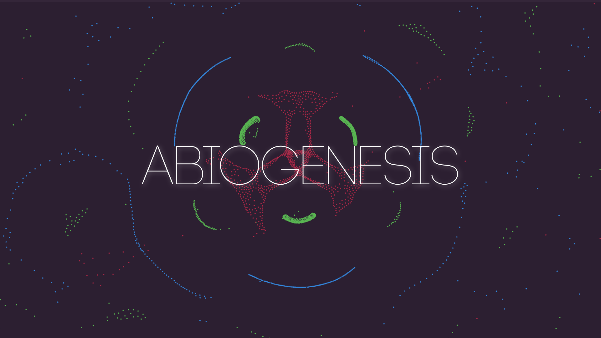

A Particle Life Sandbox, and my entry into [Bevy Jam #6](https://itch.io/jam/bevy-jam-6/rate/3610690).

Explore the rich emergent behavior from simple rules and build your own organisms to compete for mass.

## Rate my Game
Voting for [Bevy Jam #6](https://itch.io/jam/bevy-jam-6/rate/3610690) is now open, if you'd take a minute to rate my game and check out the other excellent entries that would be greatly appreciated.

## Controls
### Mouse
* **Use Selected Tool:** Left Click
* **Stop Following Organism:** Tap/Toggle the Follow Tool or Right Click & Drag
* **Pan:** Right Click & Drag
* **Zoom:** Mouse Wheel
* **Adjust Forces:** Left Click & Drag on the Force Matrix

### Touch (iOS / Android)
* **Use Selected Tool:** Single Top
* **Stop Following Organism:** Tap/Toggle the Follow Tool
* **Pan:** Two Finger Drag
* **Zoom:** Two Finger Spread/Pinch
* **Adjust Forces:** Drag on the Force Matrix

## Credits
* **Programming:** Dylan Johnston
* **Music:** Meydän - [We're Going Home](https://meydan.bandcamp.com/track/were-going-home)
* **Icons:** [FlatIcon Free Icons](https://www.flaticon.com/)